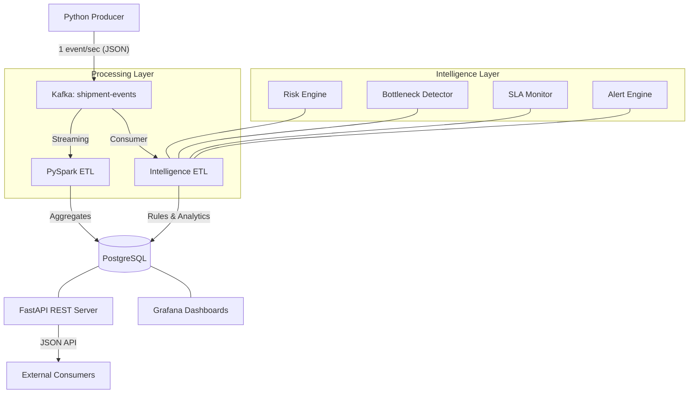

# 🚚 Smart Logistics & Supply Chain Intelligence Platform


A state-of-the-art, full-stack real-time data engineering and predictive analytics platform. This system processes high-velocity shipment data, detects supply chain bottlenecks, predicts delivery risks, and provides actionable intelligence through live dashboards.

---

## 🏗️ Architecture Overview

The platform uses a decoupled, event-driven architecture designed for high throughput and modular intelligence.



---

## ✨ Core Features

### 🚀 Enterprise Features (New)
*   **Geo Map Dashboard:** Live fleet visibility with status-coded markers and interactive popups using Leaflet.
*   **Executive Reporting:** Generate downloadable PDF and CSV management reports (Daily, Delays, KPIs).
*   **Role-Based Security:** Secure JWT authentication system with Admin, Manager, and Analyst tiers.
*   **User Management:** Administrative interface to manage platform access and roles.

### 📡 Real-Time Data Pipeline
*   **High-Velocity Ingestion:** Kafka-based stream processing capable of handling thousands of events per second.
*   **Dual Processing Paths:** Choose between **Apache Spark** for heavy windowed aggregations or the **Intelligence ETL** for rule-based predictive logic.
*   **Automated Cleaning:** Schema validation and timestamp normalization performed in-flight.

### 🧠 Supply Chain Intelligence
*   **Predictive Risk Scoring:** Each shipment is analyzed for delay risk based on historical warehouse performance and regional trends.
*   **Warehouse Bottleneck Detection:** Real-time monitoring of warehouse throughput to identify "Red Zone" facilities before they impact the network.
*   **SLA Violation Tracking:** Automated monitoring of delivery promises with severity-based reporting.
*   **Intelligent Alerting:** Multi-level alerts (Critical, High, Medium) triggered by network anomalies.

### 📊 Visualization & Consumption
*   **Live Dashboards:** 10-second auto-refreshing Grafana panels showing On-Time performance, Delivery trends, and Risk distributions.
*   **Rich REST API:** Comprehensive endpoints for integration with external CRM/ERP systems.

---

## 📂 Project Structure

```bash
Capstone/
├── analytics/           # Periodical performance analysis logic
├── api/                 # FastAPI application & REST endpoints
├── db/                  # PostgreSQL schema and initialization scripts
├── docker/              # Service containers & Dockerfiles
├── etl/                 # Rule-based Intelligence ETL engine
├── grafana/             # Provisioning for dashboards & data sources
├── producer/            # High-fidelity shipment event simulator
├── rules/               # Core business logic & risk engines
├── spark/               # PySpark Structured Streaming jobs
├── docker-compose.yml   # Main orchestration (Spark-focused)
└── .env                 # Environment configuration
```

---

## 🚀 Getting Started

### Prerequisites
*   **Docker Desktop** (v24+)
*   **Docker Compose** (v2+)
*   **Minimum 8GB RAM** (Spark and Kafka are resource-intensive)

### Installation
1. **Clone the repository:**
   ```bash
   git clone <repository-url>
   cd Capstone
   ```

2. **Start the Standard Stack (Spark-enabled):**
   ```bash
   docker compose up --build
   ```

3. **Start the Intelligence Stack (Optimized for Rules):**
   ```bash
   docker compose -f docker-compose.minimal.yml up --build
   ```

---

## 🔌 API Reference

| Endpoint | Method | Role | Description |
| :--- | :--- | :--- | :--- |
| `/login` | `GET` | All | Enterprise login portal. |
| `/dashboard` | `GET` | All | Role-based unified analytics panel. |
| `/auth/login` | `POST` | All | JWT token generation endpoint. |
| `/reports/daily.pdf` | `GET` | Admin/Manager | Professional PDF shipment report. |
| `/reports/executive.pdf`| `GET` | Admin/Manager | Consolidated KPI performance summary. |
| `/map/shipments` | `GET` | All | Geo-coordinate data for the fleet map. |
| `/users/create` | `POST` | Admin | New user provisioning. |
| `/shipments` | `GET` | All | Paginated shipment list. |

---

## 🛠️ Technology Stack

| Component | Technology | Version |
| :--- | :--- | :--- |
| **Broker** | Apache Kafka (KRaft Mode) | 3.7+ |
| **Streaming** | PySpark Structured Streaming | 3.5 |
| **Logic** | Python | 3.11 |
| **Datastore** | PostgreSQL | 16-alpine |
| **API** | FastAPI | 0.109+ |
| **Monitoring** | Grafana | 10.4 |

---

## 🔧 Troubleshooting

*   **Kafka not ready:** The producer and ETL services have built-in retry logic. If they fail initially, wait 30 seconds for Kafka to finish initializing.
*   **No Data in Grafana:** 
    1. Ensure the time range is set to "Last 15 minutes".
    2. Check if the producer is running: `docker logs logistics-producer`.
    3. Verify Spark is processing: `docker logs spark-etl`.
*   **Memory Issues:** If the platform is slow, try running the **Minimal Stack** which uses a lightweight Python ETL instead of Spark.

---

## 📄 License
This project is licensed under the MIT License - see the LICENSE file for details.
